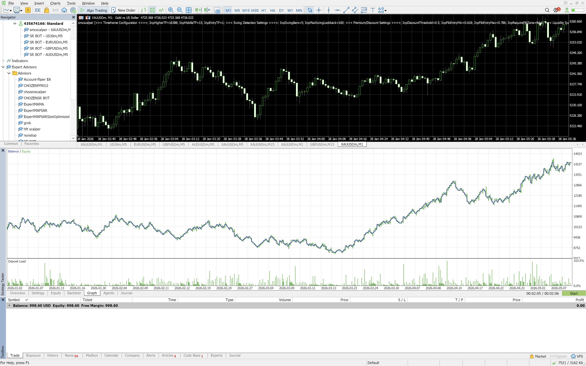
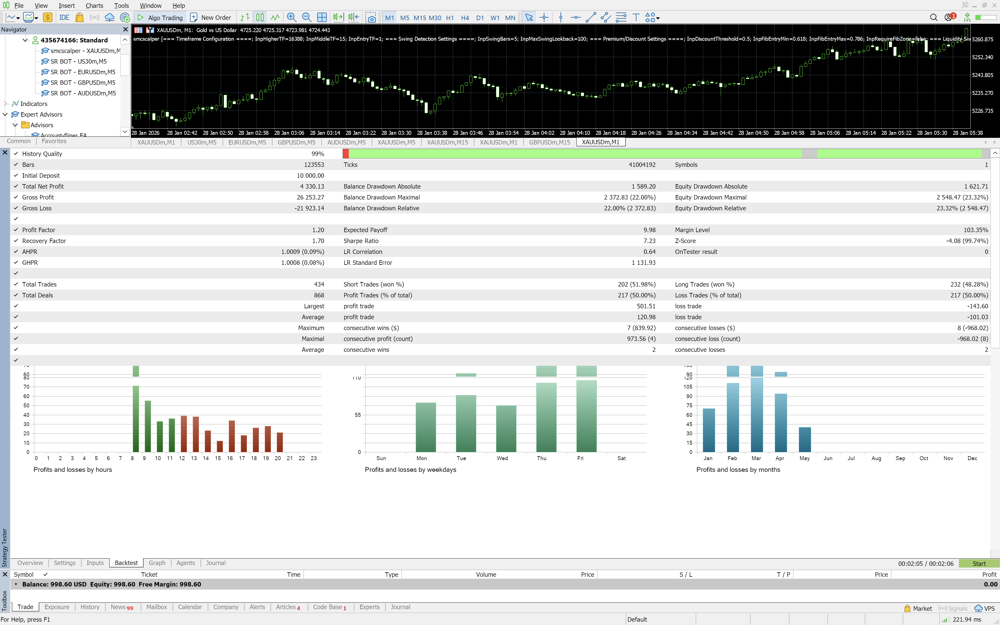
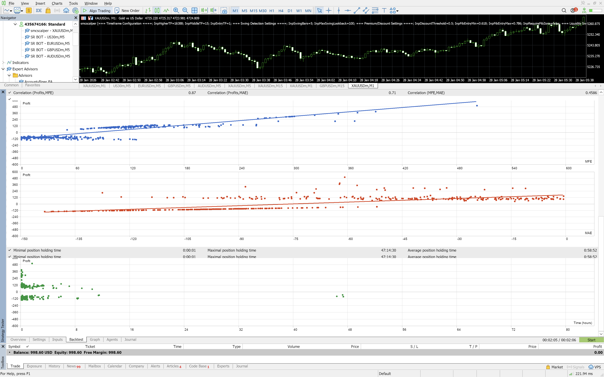

# SmartMoney MTF EA v2

**Designed and Developed by: CHOZEN TRADING SYSTEMS**

Welcome to the **SmartMoney MTF (Multi-Timeframe) EA v2**, an advanced, fully automated Expert Advisor for MetaTrader 5 that implements institutional Smart Money Concepts (SMC).

This EA is specifically engineered to analyze multiple timeframes simultaneously, identify high-probability Premium and Discount (PD) zones, and execute sniper entries using liquidity sweeps and market structure shifts.

---

## 📈 Backtest Performance Highlights (XAUUSD - M1)

The EA has been rigorously backtested with exceptional results on **Gold (XAUUSD)**. 
- **Initial Deposit:** $10,000.00
- **Total Net Profit:** $4,330.13 (+43.3%)
- **Profit Factor:** 1.20
- **Recovery Factor:** 1.70
- **Total Trades Executed:** 434
- **Win Rate:** ~50% with an excellent Risk-to-Reward profile.
- **Expected Payoff:** 9.98 per trade

*(See the attached backtest reports and equity curve screenshots below for detailed statistics).*

### Equity Curve

### Backtest Statistics

### Correlation

---

## 🔥 Key Features

### 1. Multi-Timeframe (MTF) Alignment
- **Higher Timeframe (HTF):** Determines the overall macro trend (e.g., H4/H1).
- **Middle Timeframe:** Maps out the market structure to establish Premium and Discount zones (e.g., M15/M5).
- **Entry Timeframe (LTF):** Scans for exact execution triggers (e.g., M1).

### 2. Smart Money Concepts (SMC) Logic
- **Premium & Discount Zones:** Automatically calculates equilibrium (50%) and filters long trades in Discount and short trades in Premium.
- **Optimal Trade Entry (OTE):** Uses 61.8% to 78.6% Fibonacci retracement zones for precise entries.
- **Liquidity Sweeps:** Identifies when retail stop-losses are triggered before a reversal.
- **Market Structure Shifts (MSS/CHOCH):** Confirms the intent of smart money before placing a trade.
- **Consolidation Breakouts:** Detects and trades out of accumulation/distribution ranges.

### 3. Advanced Risk Management
- **Dynamic Lot Sizing:** Risk a fixed percentage (e.g., 1%) of the account balance per trade.
- **Breakeven & Trailing Stops:** Automatically protects profits once a specified Risk:Reward ratio is hit.
- **Extended Targets:** Aims for higher RR targets on liquidity sweep setups.

### 4. Customizable Trading Sessions
- Trade only during the highest volume hours with built-in filters for **London**, **New York**, and **Asian** sessions.

---

## ⚙️ EA Parameters Overview

- **Swing Detection:** Customize the bars required to validate swing highs and lows.
- **PD Settings:** Adjust the Discount/Premium thresholds and Fib entry requirements.
- **Risk Management:** Define max RR, minimum RR, SL buffers, and Max Spread/Slippage limits.
- **Daily Limits:** Control over-trading with Max Daily Trades and Max Open Positions settings.
- **Debug & Chart Zones:** Optionally draw PD zones and structure points directly on your chart for visual backtesting.

---

## 💻 Installation Instructions

1. Download the `SmartMoney_MTF_EA_v2.mq5` file.
2. Open MetaTrader 5 and go to `File` -> `Open Data Folder`.
3. Navigate to `MQL5` -> `Experts` and paste the file there.
4. Refresh your Expert Advisors list in the MT5 Navigator panel or restart the terminal.
5. Compile the code using the MetaEditor if necessary.
6. Attach the EA to an `M1` chart (Highly optimized for XAUUSD) and ensure **Algo Trading** is enabled.

---

## ⚠️ Disclaimer

Forex and CFD trading carries a high level of risk and may not be suitable for all investors. Past performance is not indicative of future results. Please test this Expert Advisor thoroughly on a demo account before using real funds.

---
**© 2026 CHOZEN TRADING SYSTEMS. All Rights Reserved.**
